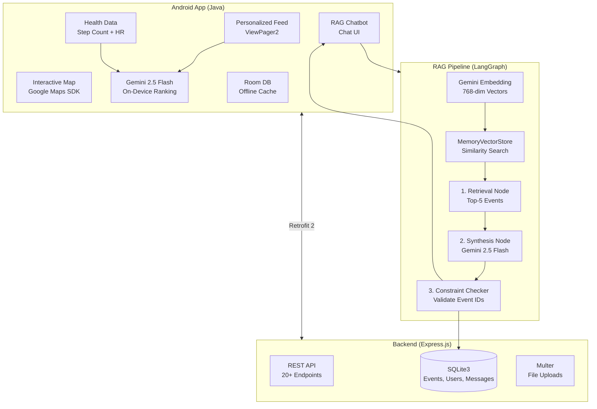
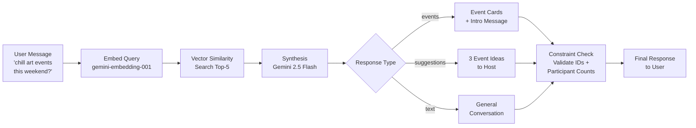
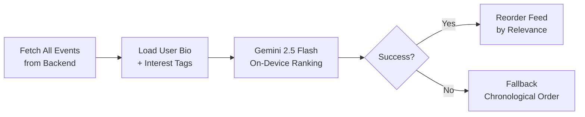

## Context

Built as a team project. The problem: social isolation is a growing issue, and existing event platforms don't do much to actively *connect* people. They list events — but they don't understand what you'd actually enjoy, or help you discover things you wouldn't search for yourself. We wanted to build something smarter.

## What We Built

**Buddeee** is a community-driven Android app that helps isolated individuals discover and connect through local events in Singapore. It combines AI-powered recommendations, an interactive map with 70+ event category markers, a RAG-powered chatbot, and gamified community features — all aimed at lowering the barrier to showing up.

## Core Features

- **Personalized Feed** — two-tab home with "Personalized" and "Recommended" events, re-ranked on-device by Gemini based on your bio and interests
- **Interactive Map** — Google Maps with custom emoji markers for 70+ event categories, real-time geolocation, and nearby event search
- **RAG Chatbot** — natural language event discovery powered by a LangGraph pipeline with semantic search, so you can ask "any chill art events this weekend?" instead of scrolling through filters
- **Health-Based Recommendations** — integrates step count and heart rate data to suggest events matching your fitness level
- **Event Management** — full CRUD with photo uploads, participant tracking, and category tagging
- **Messaging** — direct user-to-user messaging with event invite sharing
- **Gamified Community** — isometric neighborhood visualization, achievement system, and a decoration shop to customize your community space

## Tech Stack

**Frontend (Android):**
- `Java` + `Android SDK` (API 36) — native Android development
- `Material Design 3` — UI framework with ViewPager2, RecyclerView, Flexbox
- `Google Maps SDK` — interactive map with custom emoji markers
- `Google Gemini 2.5 Flash` — on-device event re-ranking via generative-ai SDK
- `Retrofit 2` + `OkHttp3` — REST API communication
- `Room` — local SQLite ORM for offline caching
- `ExoPlayer (Media3)` — video playback
- `Glide` — image loading with caching

**Backend (Node.js):**
- `Express.js` — REST API with 20+ endpoints
- `SQLite3` — database for events, users, messages, interactions
- `bcrypt` — password hashing
- `Multer` — file uploads (10MB limit)

**AI / RAG Pipeline:**
- `LangGraph` — 3-node state machine for chatbot orchestration
- `LangChain` — RAG framework
- `Google Gemini 2.5 Flash` — LLM for synthesis and on-device ranking
- `Gemini Embedding (gemini-embedding-001)` — 768-dimensional semantic search embeddings
- `MemoryVectorStore` — in-memory vector store for event similarity search

## System Architecture

## How the RAG Chatbot Works

The chatbot is the most technically interesting part. Instead of keyword-based event search, users can ask natural language questions and get relevant results. The backend runs a 3-node LangGraph pipeline:

1. **Retrieval Node** — embeds the user's message using `gemini-embedding-001`, then runs vector similarity search against all events in the MemoryVectorStore. Returns the top 5 most semantically relevant events.

2. **Synthesis Node** — takes the user's message, conversation history, and retrieved events, then sends everything to Gemini 2.5 Flash. The model returns structured JSON with a response type: `events` (search results with intro message), `suggestions` (3 event creation ideas if the user wants to host), or `text` (general conversation).

3. **Constraint Checker Node** — validates that returned event IDs still exist in the database, updates real-time participant counts, and filters out deleted events. This prevents the chatbot from recommending stale data.

The vector store is re-indexed on server startup, and conversation history is tracked across multi-turn interactions so the chatbot maintains context.

## RAG Chatbot Pipeline

## On-Device AI Ranking

The personalized feed doesn't just filter by tags — it uses Gemini 2.5 Flash directly on the device to re-rank events. The flow:

1. Fetch all events from the backend
2. Load the user's bio and interest tags from SharedPreferences
3. Send both to Gemini with a ranking prompt
4. Gemini returns event IDs in relevance order
5. UI reorders the event list — no server round-trip needed

If Gemini fails (network issues, API errors), the feed falls back to the original chronological order.

### On-Device Ranking Flow

## Interesting Challenges

**Semantic search vs. keyword search.** Traditional event platforms use keyword matching — search "yoga" and you get yoga events. Our RAG approach understands intent: "something relaxing after work" can surface yoga, meditation, art workshops, and nature walks. The embedding model captures semantic similarity, not just string matching. This made the chatbot significantly more useful for discovery.

**Structured JSON from LLMs.** The chatbot needs to return structured data (event IDs, response types, messages) — not free-form text. Getting Gemini to consistently return valid JSON with the right schema required careful prompt engineering. We handle parsing failures gracefully: if JSON extraction fails, the response falls back to plain text mode.

**70+ event category markers on the map.** Each event category (sports, arts, food, music, wellness, etc.) gets its own emoji marker on Google Maps. Managing marker rendering performance with 70+ categories and potentially hundreds of events required careful clustering and lazy loading.

**Health-based filtering without being creepy.** We integrate step count and heart rate data to suggest appropriate events, but we had to be careful about privacy. All health data stays on-device — the backend never sees it. The filtering logic runs locally, and users can opt out entirely.

**Real-time participant tracking.** When the chatbot recommends an event, the participant count needs to be current — not stale from the last vector store index. The constraint checker node queries the database in real-time for every chatbot response, ensuring users don't get directed to full events.

## What I Learned

The RAG architecture was the right call for event discovery. Users don't always know what they're looking for — they describe a mood or a vague interest, and semantic search handles the ambiguity far better than filters ever could. The 3-node LangGraph pipeline kept the chatbot grounded: retrieval ensures relevance, synthesis makes it conversational, and constraint checking keeps it honest.

The on-device ranking with Gemini was surprisingly fast and effective. Offloading personalization to the client means zero backend load for ranking, and the results feel instant compared to a server round-trip.

The code is available on [GitHub](https://github.com/fearyj/Buddeee).
