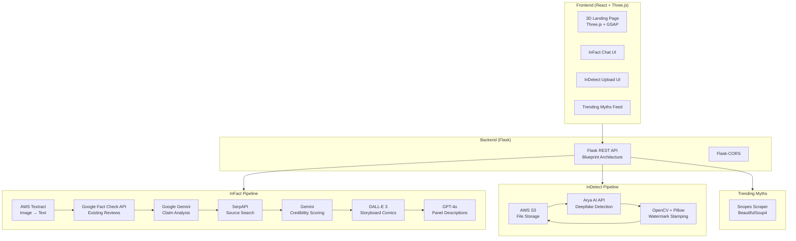
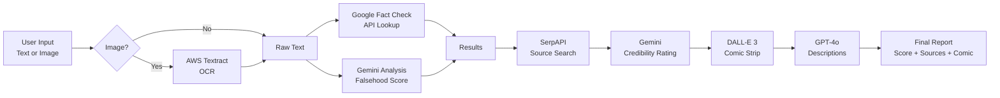

## Context

Built for **TechFest 2025**. The idea: misinformation spreads faster than corrections, and most people don't have the tools or time to verify what they see online. We wanted to build a single platform that could fact-check text, detect deepfakes, and make the results shareable and educational.

## What We Built

**inCredible AI** is an all-in-one misinformation detection platform with three core modules:

- **InFact** — a chat-based fact-checker that analyzes text or images, scores claims for falsehood, retrieves sources with credibility ratings, and generates educational storyboard comics
- **InDetect** — a deepfake detector that identifies AI-generated images and videos, then watermarks them with a "DEEPFAKE!!" stamp for easy sharing
- **Trending Myths** — scrapes and displays recently debunked misinformation from Snopes

## Tech Stack

**Frontend:**
- `React 18` + `Vite` — UI framework and build tool
- `Three.js` + `React Three Fiber` — 3D visualizations on landing page
- `Tailwind CSS` — styling
- `GSAP` — animations
- `Axios` — API communication
- `EmailJS` — contact form integration

**Backend:**
- `Flask` — Python REST API with Blueprint architecture
- `Flask-CORS` — cross-origin request handling

**AI / ML APIs:**
- `OpenAI GPT-4o` — storyboard analysis and description generation
- `OpenAI DALL-E 3` — educational comic storyboard generation
- `Google Gemini` (gemini-2.0-flash, gemini-1.5-pro) — claim analysis, falsehood scoring, source credibility evaluation
- `Arya AI API` — deepfake detection for images and videos
- `Google Fact Check API` — retrieves existing fact-check reviews
- `SerpAPI` — web search for source retrieval

**Computer Vision:**
- `OpenCV` — image and video frame processing
- `YOLOv8` — object detection
- `Pillow` — image manipulation and watermark stamping

**Cloud (AWS):**
- `AWS Textract` — OCR text extraction from uploaded images
- `AWS S3` — storage for original uploads and processed results
- `Boto3` — AWS SDK for Python

**Web Scraping:**
- `BeautifulSoup4` — parsing Snopes for trending debunked myths

## System Architecture

## How It Works

### InFact — Fact-Checking Pipeline

The fact-checking flow chains 5 different APIs together:

1. **Input** — user submits text or uploads an image (screenshot, article, etc.)
2. **Text Extraction** — if image, AWS Textract extracts readable text via OCR
3. **Fact Check Lookup** — Google Fact Check API retrieves any existing reviews for the claim
4. **AI Analysis** — Gemini analyzes the claim and returns a falsehood percentage (0-100%), reasoning, tips for spotting similar misinformation, and potential consequences of believing it
5. **Source Search** — SerpAPI finds relevant web sources, then Gemini evaluates each source's credibility
6. **Storyboard** — DALL-E 3 generates a 4-panel comic strip showing the motive behind the misinformation and its consequences, then GPT-4o writes a description of each panel

The result is a comprehensive breakdown: falsehood score with progress bar, credibility-rated sources, detailed reasoning, practical tips, and a shareable comic.

### InFact Data Flow

### InDetect — Deepfake Detection

1. User uploads an image or video (JPG, PNG, GIF, MP4, MOV)
2. File is uploaded to S3 and sent to Arya AI's deepfake detection API
3. If deepfake is detected:
   - For videos: key frames are extracted
   - A semi-transparent red "DEEPFAKE!!" stamp is overlaid at 45 degrees with distressed texture
   - The marked version is uploaded to S3
4. Results are displayed with one-click sharing to Facebook, Twitter, Telegram, and WhatsApp

### Source Credibility Scoring

We built a hybrid credibility system:
- **Known domains** get hardcoded baselines (Reuters/BBC/AP: 92-95%, InfoWars: 20%)
- **Unknown domains** get dynamically evaluated by Gemini based on content quality, sourcing, and editorial standards
- Each source shows its credibility percentage alongside the fact-check results

## Interesting Challenges

**Chaining 7+ APIs without it feeling slow.** Each fact-check hits Textract, Google Fact Check, Gemini (twice), SerpAPI, DALL-E 3, and GPT-4o. We parallelized where possible — source search and AI analysis run concurrently, and the storyboard generates in the background while the main results are already displayed.

**Deepfake watermarking that looks convincing.** The stamp needed to look like an actual rubber stamp, not a clean digital overlay. We added 5% random noise speckles for a distressed texture effect, semi-transparency, and 45-degree rotation. Font sizing and positioning scale dynamically based on image dimensions.

**Credibility scoring for unknown domains.** Hardcoded scores for major outlets are easy, but the long tail of random blogs and news sites needed dynamic evaluation. We prompt Gemini with the source URL, article content, and ask it to assess credibility on journalistic standards — not perfect, but better than no signal.

**Image-to-text for fact-checking screenshots.** A lot of misinformation spreads as screenshots — WhatsApp forwards, Twitter screenshots, article clippings. AWS Textract handles the OCR, and we concatenate the detected text blocks into a coherent claim that the fact-checking pipeline can analyze.

## What I Learned

The multi-API approach was both the project's strength and its biggest complexity. Each API adds latency, cost, and a potential failure point. But the result is much more comprehensive than any single API could provide — you get fact-check reviews, AI analysis, credibility-rated sources, AND a visual explanation, all from one query.

The storyboard feature was surprisingly effective for engagement. People are more likely to share a comic strip that explains *why* misinformation exists than a dry percentage score. Making fact-checking shareable is half the battle.

The code is available on [GitHub](https://github.com/fearyj/inCredible-AI).
