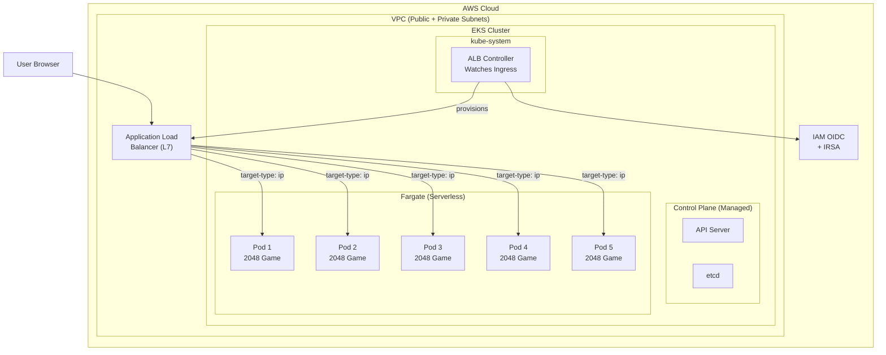
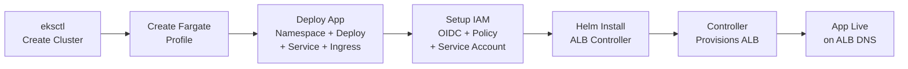

## Context

I wanted to get hands-on experience with Kubernetes in a real cloud environment — not just Minikube on my laptop. The goal: deploy an application end-to-end on AWS EKS, using Fargate for serverless compute and an Application Load Balancer for ingress. No shortcuts, no managed consoles — everything through the CLI.

## The Problem

Running Kubernetes locally is one thing. Running it in production on AWS involves a lot more moving parts: IAM roles, OIDC providers, VPC networking, Fargate profiles, and load balancer controllers. I wanted to understand how all these pieces fit together — from cluster creation to a publicly accessible app.

## What I Built

A full end-to-end Kubernetes deployment on AWS EKS:

- **EKS cluster** with Fargate (serverless — no EC2 nodes to manage)
- **2048 game app** deployed as a Kubernetes Deployment with 5 replicas
- **AWS ALB Ingress Controller** installed via Helm to provision an Application Load Balancer
- **IAM OIDC + IRSA** for secure pod-level AWS permissions
- The final result: a publicly accessible 2048 game running on Kubernetes, reachable through an ALB DNS endpoint

## Tech Stack

**AWS Infrastructure:**
- `Amazon EKS` — managed Kubernetes control plane
- `AWS Fargate` — serverless compute for pods (no EC2 instances)
- `Application Load Balancer (ALB)` — L7 load balancer provisioned automatically by the Ingress controller
- `IAM OIDC Provider` — enables Kubernetes service accounts to assume IAM roles (IRSA)

**Kubernetes Tooling:**
- `eksctl` — CLI for creating and managing EKS clusters and Fargate profiles
- `kubectl` — cluster interaction, manifest deployment, resource verification
- `Helm` — package manager for installing the ALB controller

**Application:**
- `2048 Game` — containerized browser game (`public.ecr.aws/l6m2t8p7/docker-2048`)
- Deployed as Deployment (5 replicas) + NodePort Service + ALB Ingress

## System Architecture



## Step-by-Step Deployment

### 1. Create the EKS Cluster

```bash
eksctl create cluster --name demo-cluster --region us-east-1 --fargate
```

This provisions the entire EKS control plane, a VPC with public and private subnets, and a default Fargate profile. Takes about 15-20 minutes. With Fargate, there are no EC2 worker nodes — pods run directly on AWS-managed infrastructure.

### 2. Configure kubectl

```bash
aws eks update-kubeconfig --region us-east-1 --name demo-cluster
```

This writes the cluster endpoint and auth config to `~/.kube/config` so `kubectl` can communicate with the cluster.

### 3. Create a Fargate Profile for the App

```bash
eksctl create fargateprofile \
  --cluster demo-cluster \
  --region us-east-1 \
  --name alb-sample-app \
  --namespace game-2048
```

Fargate requires explicit namespace bindings. Pods in the `game-2048` namespace won't schedule without their own Fargate profile — this is a common gotcha.

### 4. Deploy the Application

```bash
kubectl apply -f https://raw.githubusercontent.com/kubernetes-sigs/aws-load-balancer-controller/v2.5.4/docs/examples/2048/2048_full.yaml
```

This single manifest creates four resources:

- **Namespace** (`game-2048`)
- **Deployment** — 5 replicas of the 2048 game container on port 80
- **Service** — NodePort type, forwards port 80 to the pods
- **Ingress** — annotated for ALB with `internet-facing` scheme and `ip` target type

At this point, the Ingress exists but there's no controller to fulfill it — no load balancer gets created yet.

### 5. Set Up IAM OIDC Provider

```bash
eksctl utils associate-iam-oidc-provider --cluster demo-cluster --approve
```

This enables IRSA (IAM Roles for Service Accounts). The ALB controller needs AWS permissions to create and manage load balancers — OIDC lets a Kubernetes service account securely assume an IAM role without embedding credentials.

### 6. Create IAM Policy for the ALB Controller

```bash
curl -O https://raw.githubusercontent.com/kubernetes-sigs/aws-load-balancer-controller/v2.11.0/docs/install/iam_policy.json

aws iam create-policy \
  --policy-name AWSLoadBalancerControllerIAMPolicy \
  --policy-document file://iam_policy.json
```

This policy grants the ALB controller permissions to create/modify ALBs, target groups, listeners, and security groups.

### 7. Create IAM Service Account

```bash
eksctl create iamserviceaccount \
  --cluster=demo-cluster \
  --namespace=kube-system \
  --name=aws-load-balancer-controller \
  --role-name AmazonEKSLoadBalancerControllerRole \
  --attach-policy-arn=arn:aws:iam::<ACCOUNT_ID>:policy/AWSLoadBalancerControllerIAMPolicy \
  --approve
```

This creates a Kubernetes service account in `kube-system` that's bound to the IAM role. When the ALB controller pod runs under this service account, it inherits the AWS permissions.

### 8. Install the ALB Controller via Helm

```bash
helm repo add eks https://aws.github.io/eks-charts
helm repo update eks

helm install aws-load-balancer-controller eks/aws-load-balancer-controller \
  -n kube-system \
  --set clusterName=demo-cluster \
  --set serviceAccount.create=false \
  --set serviceAccount.name=aws-load-balancer-controller \
  --set region=us-east-1 \
  --set vpcId=<YOUR_VPC_ID>
```

Key flags: `serviceAccount.create=false` because we already created the service account with IAM role binding. The controller watches for Ingress resources and provisions ALBs automatically.

### 9. Verify and Access

```bash
kubectl get deployment -n kube-system aws-load-balancer-controller
kubectl get ingress -n game-2048
```

Once the controller detects the Ingress resource, it provisions an ALB. The `ADDRESS` column in the Ingress output shows the ALB DNS name — open it in a browser and the 2048 game is live.

## Deployment Flow



## Key Kubernetes Manifests

The Ingress resource is the most important piece — it tells the ALB controller what to provision:

```yaml
apiVersion: networking.k8s.io/v1
kind: Ingress
metadata:
  name: ingress-2048
  namespace: game-2048
  annotations:
    alb.ingress.kubernetes.io/scheme: internet-facing
    alb.ingress.kubernetes.io/target-type: ip
spec:
  ingressClassName: alb
  rules:
    - http:
        paths:
          - path: /
            pathType: Prefix
            backend:
              service:
                name: service-2048
                port:
                  number: 80
```

- `scheme: internet-facing` — makes the ALB publicly accessible (vs. `internal`)
- `target-type: ip` — routes directly to pod IPs instead of node ports. This is **required for Fargate** since there are no traditional nodes
- `ingressClassName: alb` — tells the ALB controller (not nginx or other controllers) to handle this Ingress

## Why Ingress Over LoadBalancer Service?

A common question: why not just use `type: LoadBalancer` on the Service? The answer is cost and flexibility:

- **LoadBalancer Service** = one ALB per service. If you have 10 microservices, that's 10 ALBs (~$160/month each)
- **Ingress** = one ALB with path/host-based routing rules. 10 services can share a single ALB, with routes like `/api` → service-a, `/auth` → service-b

For a single app it doesn't matter much, but in production with multiple services, Ingress is the standard pattern.

## Challenges I Ran Into

**Fargate profile namespace binding.** Pods in `game-2048` wouldn't schedule until I created a dedicated Fargate profile for that namespace. The default profile only covers `default` and `kube-system`. This isn't obvious from the error messages — pods just sit in `Pending` state.

**IAM OIDC setup order matters.** If you install the ALB controller before setting up the OIDC provider and IAM service account, the controller pods will start but fail to provision any ALBs. The logs show `AccessDenied` errors. The fix is to set up IAM first, then install the controller.

**VPC ID for Helm install.** The Helm chart requires the VPC ID explicitly. I had to grab it from the AWS console or `eksctl` output. Missing this flag causes the controller to fail silently.

**ALB provisioning delay.** After the controller starts, it takes 2-3 minutes to provision the ALB and for DNS to propagate. The Ingress shows an empty `ADDRESS` field during this time — patience is needed.

## What I Learned

The biggest takeaway: Kubernetes on AWS is 50% Kubernetes and 50% IAM. The OIDC provider, IAM policies, service account bindings, and role assumptions are where most of the complexity (and debugging) lives. The actual Kubernetes deployment and service manifests are straightforward.

Fargate simplifies node management but adds constraints — explicit namespace profiles, no DaemonSets, and the requirement for `target-type: ip` on Ingress. It's a tradeoff between operational simplicity and flexibility.

The Ingress controller pattern is elegant. Instead of each service managing its own load balancer, a single controller watches for Ingress resources and reconciles the desired state with AWS infrastructure. It's Kubernetes' declarative model extending into cloud infrastructure.
